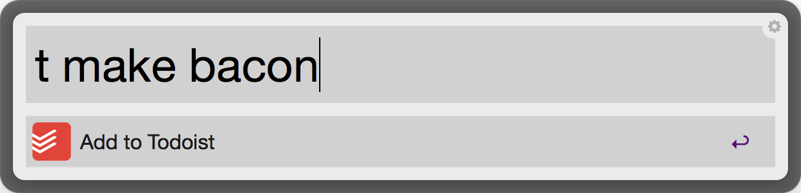

#Todoist Workflow for [Alfred 2](http://www.alfredapp.com/)
Quickly add tasks to Todoist. The keyword is "t" (example ```t take a shower;4```).



##Setup
You have to enter your access token into the ```config.py``` folder
````
# config.py
ACCESS_TOKEN="{YOUR_ACCESS_TOKEN}"
````
Your access token can be found under settings:
.

###Please leave issues if you encounter any problems or star this repo if you found it useful :)
